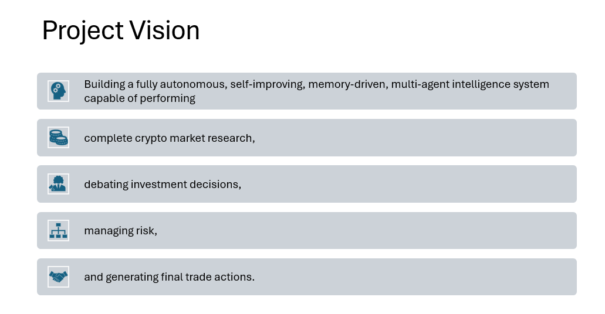
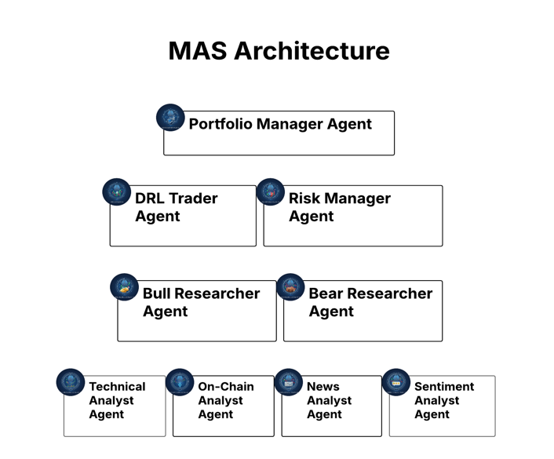
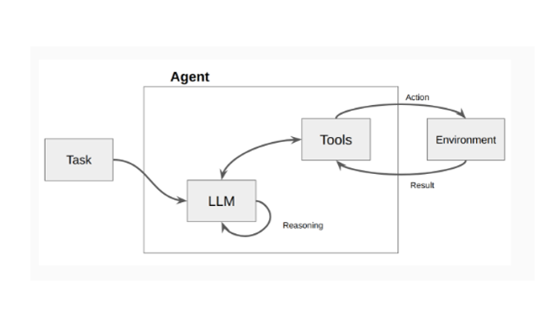
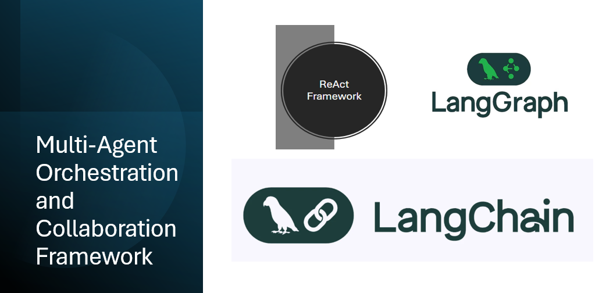
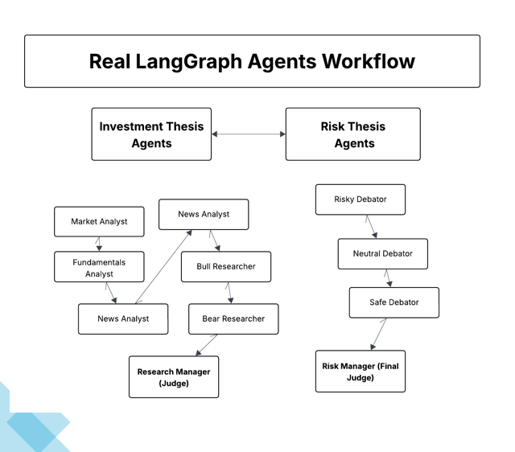
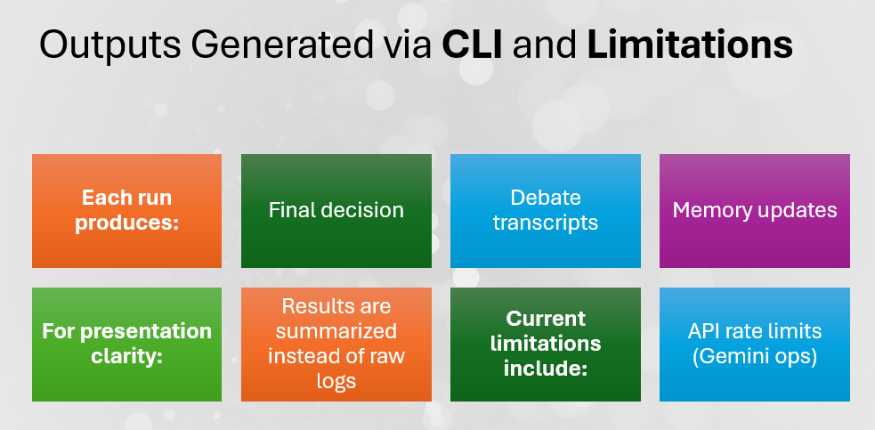

# A Multi Agent Framework for Crypto Portfolio Managemant
Crypto MAS Project aims to replicate the workflow of a crypto asset management firm by architecting a multi-agent framework where each agent gets a specific human role. By deploying specialized LLM-powered agents, the framework  evaluates market conditions and informs trading decisions. These agents engage in collaborative discussions to pinpoint the optimal strategy.

## Project Vision
<p align="center">
  
</p>
> Crypto MAS framework is designed for research purposes. It is not intended as financial, investment, or trading advice. Trading performance may vary based on many factors, such as the chosen language models, model temperature, trading periods, the quality of data, and other non-deterministic factors.

## Crypto MAS Architecture
<p align="center">
  
</p>

## Agent Definition
<p align="center">
  
</p>

## Orchestra and Collaboration Framework
<p align="center">
  
</p>

## Real LangGraph Workflow
<p align="center">
  
</p>

## Outputs and Limitations
<p align="center">
  
</p>

### Installation

Clone Crypto MAS Project:
```bash
https://github.com/hammadqaiser/Multi-Agent-Framework-for-Crypto-Portfolio-Management.git
cd CryptoMAS
```


